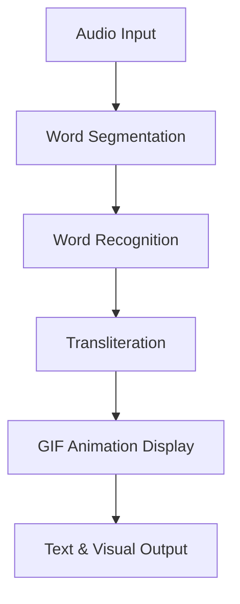
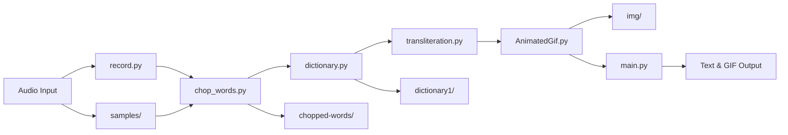
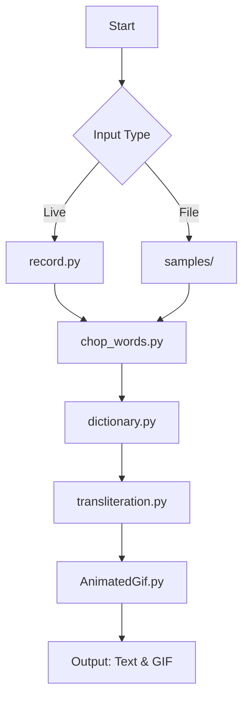
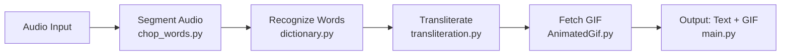
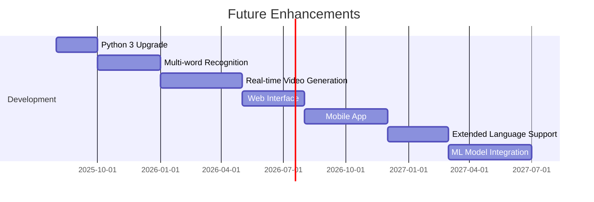

# 🧠 Sign Language Detection App

A **Python-based application** that transforms **audio speech** into **sign language representations** using advanced word recognition and transliteration.

---

## 📋 Overview

The **Sign Language Detection App** converts audio input—either **live recordings** or **pre-recorded files**—into **visual sign language representations**. It processes spoken words, recognizes them, transliterates them (e.g., Hindi to English), and displays corresponding **GIF animations** from a pre-trained dictionary.

**Key Workflow**:


---

## ✨ Features

- 🎙️ **Live Audio Recording**: Capture audio in real-time for instant processing.
- 📂 **Pre-recorded Audio Support**: Process existing `.wav` files from the `samples/` directory.
- 🔍 **Word Recognition**: Accurately identify spoken words using audio processing.
- 🌐 **Multi-language Support**: Includes Hindi transliteration capabilities.
- 🎥 **Visual Sign Language**: Display sign language GIFs for recognized words.
- 💾 **Dictionary Caching**: Use serialized dictionaries for faster performance.
- ✂️ **Audio Segmentation**: Automatically segment continuous speech into individual words.

---

## 🛠️ Technical Components

### System Architecture


### Core Modules
- **🔧 `main.py`**:
  - Coordinates audio processing, word recognition, and transliteration.
  - Loads and caches dictionary data.
  - Resolves GIF paths for visual output.
- **🎙️ `record.py`**:
  - Captures real-time audio using **PyAudio**.
  - Configurable recording duration.
  - Outputs `.wav` files.
- **🛠️ Supporting Modules**:
  - `chop_words.py`: Segments audio into individual words.
  - `dictionary.py`: Matches audio segments to dictionary entries.
  - `transliteration.py`: Converts text across languages (e.g., Hindi to English).
  - `AnimatedGif.py`: Handles loading and displaying GIF animations.

---

## 📦 Dependencies

Install the required libraries:
```bash
pip install pyaudio wave pickle
```

**System Requirements**:
- **Python 2.7** (Note: Uses legacy Python 2 syntax; see Future Enhancements for Python 3 plans).
- Audio input device (microphone).
- Required audio codec support.

---

## 🚀 Installation

1. **Clone the Repository**:
   ```bash
   git clone https://github.com/yourusername/sign-language-detection-app.git
   cd sign-language-detection-app
   ```

2. **Install Dependencies**:
   ```bash
   pip install -r requirements.txt
   ```

3. **Verify Directory Structure**:
   ```
   sign-language-detection-app/
   ├── main.py                 # Main application logic
   ├── record.py              # Audio recording functionality
   ├── chop_words.py          # Audio word segmentation
   ├── dictionary.py          # Word recognition dictionary
   ├── transliteration.py     # Language transliteration
   ├── AnimatedGif.py         # GIF animation handling
   ├── dictionary1/           # Dictionary data and cache
   │   ├── serialized.txt
   │   └── dictionary.pkl
   ├── samples/               # Pre-recorded audio samples
   │   └── [audio files].wav
   ├── img/                   # Sign language GIF animations
   │   └── [sign language gifs].gif
   ├── chopped-words/         # Temporary segmented audio files
   └── README.markdown
   ```

---

## 💻 Usage

### 1. 🎙️ Live Audio Recording
Record and process audio in real-time:
```python
from main import callByAudio
result, gif_path = callByAudio()
print(result)  # Recognized word with transliteration
```

### 2. 📂 Process Pre-recorded Audio
Process a specific audio file:
```python
from main import callByName
result, gif_path = callByName("word_name")
print(result)  # Recognized word with transliteration
```

### 3. 📄 Direct Audio File Processing
Process an audio file directly:
```python
from main import start
result, gif_path = start("path/to/audio/file.wav")
```

### 4. 🖥️ Command Line Recording
Record audio for a specified duration:
```bash
python record.py [DURATION_IN_SECONDS]
```

**Usage Flowchart**:


---

## ⚙️ Configuration

### Audio Settings
- **Sample Rate**: 44,100 Hz
- **Channels**: Mono (1 channel)
- **Format**: 16-bit PCM
- **Default Recording Duration**: 3 seconds

### Dictionary Settings
- **Location**: `dictionary1/` directory
- **Caching**: Automatic serialization on first run for performance
- **Files**: `serialized.txt`, `dictionary.pkl`

---

## 🎯 How It Works

1. **🎙️ Audio Input**: Capture live audio or load a `.wav` file.
2. **✂️ Word Segmentation**: Split audio into individual word segments.
3. **🔍 Word Recognition**: Match segments against a pre-trained dictionary.
4. **🌐 Transliteration**: Convert recognized words (e.g., Hindi to English).
5. **🎥 Visual Output**: Retrieve and display corresponding sign language GIFs.
6. **📝 Result**: Return both text and GIF paths.

**Detailed Workflow**:


---

## ⚠️ Limitations

- Optimized for **single-word recognition**; multi-word phrases are not fully supported.
- Requires **pre-trained dictionary data** in `dictionary1/`.
- **GIF animations** must be pre-created and stored in `img/`.
- Uses **Python 2.7** (legacy; see Future Enhancements for Python 3 upgrade).
- Recognition accuracy depends on **audio quality**.

---

## 🔧 Troubleshooting

### "Problem in Recognition" Error
- **Cause**: Word count ≠ 1.
- **Solution**:
  - Ensure clear, single-word pronunciation.
  - Check audio quality and microphone functionality.

### "Word Not Found" Error
- **Cause**: Audio file not found in `samples/` directory.
- **Solution**:
  - Verify file path and `.wav` extension.
  - Check naming conventions.

---

## 🤝 Contributing

We welcome contributions to enhance the app! Follow these steps:
1. Fork the repository.
2. Create a feature branch: `git checkout -b feature/amazing-feature`
3. Commit changes: `git commit -m 'Add amazing feature'`
4. Push to the branch: `git push origin feature/amazing-feature`
5. Open a Pull Request.

---

## 📈 Future Enhancements

- [ ] Upgrade to **Python 3** for modern compatibility.
- [ ] Support **multi-word phrase recognition**.
- [ ] Enable **real-time sign language video generation**.
- [ ] Integrate a **web interface** for user-friendly access.
- [ ] Develop a **mobile app** for broader reach.
- [ ] Add **extended language support** beyond Hindi.
- [ ] Incorporate **machine learning models** for improved recognition.

**Enhancement Roadmap**:


---

## 📄 License

This project is licensed under the **MIT License**—see the [LICENSE](LICENSE) file for details.

---

## 👥 Authors

- **Your Name** - *Initial work* - [YourGitHub](https://github.com/yourusername)

---

## 🙏 Acknowledgments

- **Sign Language Community** for inspiration and support.
- **Audio Processing Libraries** contributors.
- **Open Source Community** for tools and resources.

---

<div align="center">

**⚡ Ready to bridge audio and sign language? Run the app and start exploring! ⚡**

*Built with ❤️ for accessible communication*

</div>
